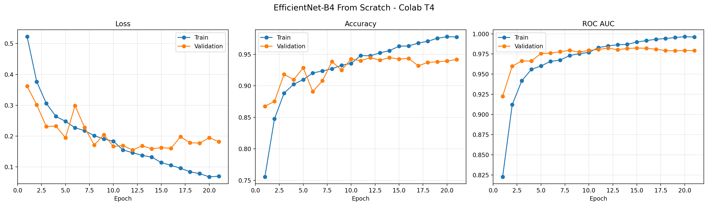
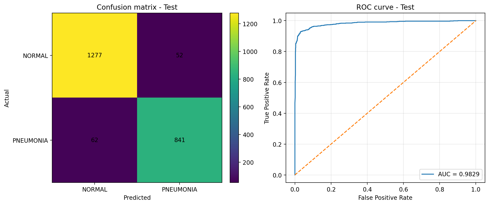
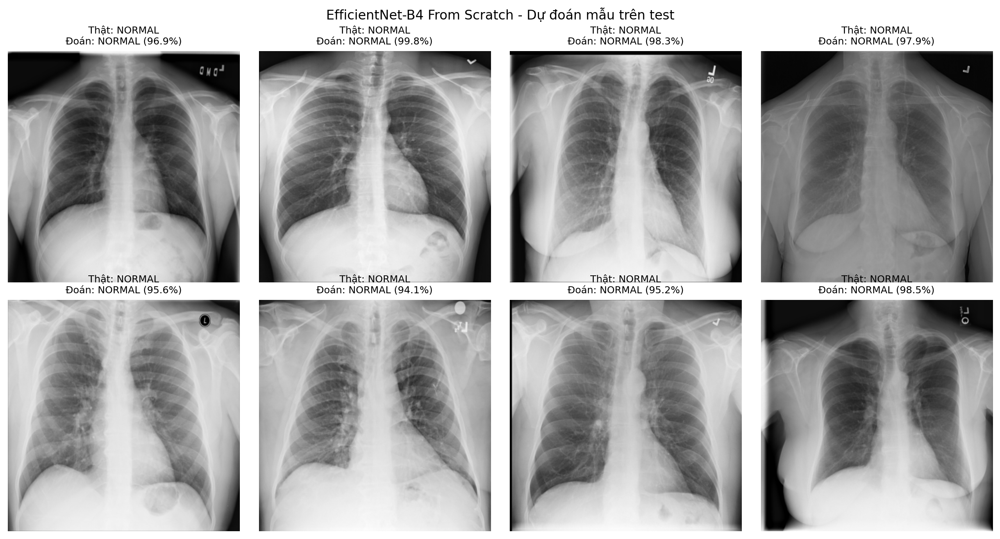
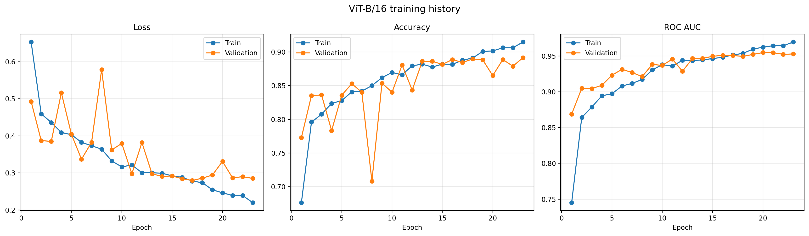
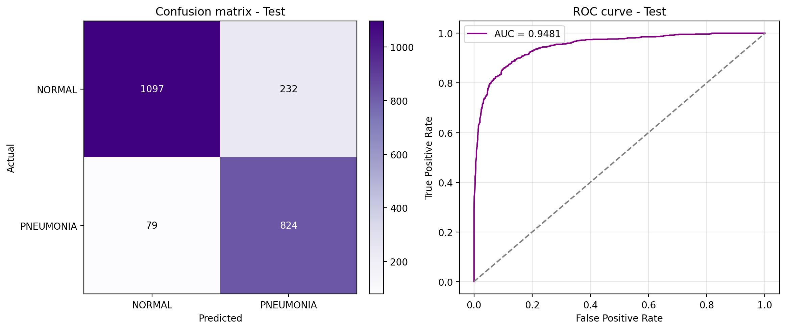
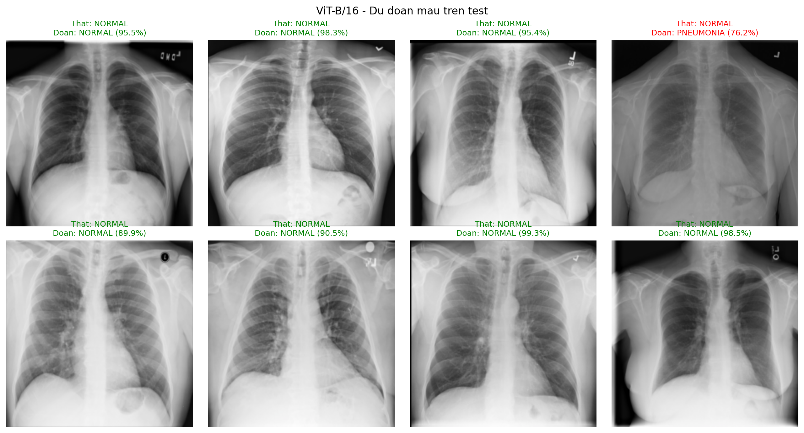

# PneumoShield AI - Phân Loại Viêm Phổi Qua Ảnh X-Quang Lồng Ngực (CNN vs. Vision Transformer)

<p align="center">
  
  
  
  
  
</p>

Dự án nghiên cứu và phát triển giải pháp Trí tuệ nhân tạo (AI/Deep Learning) trong chẩn đoán hình ảnh y tế: **Phân loại ảnh X-quang lồng ngực (Chest X-Ray) nhằm phát hiện Viêm phổi (Pneumonia)**. Đồ án tập trung nghiên cứu, đối sánh thực nghiệm giữa hai trường phái kiến trúc thị giác máy tính: **CNN (EfficientNet-B4)** và **Vision Transformer (ViT-B/16)** theo cả hai chiến lược **Train From Scratch** (khởi tạo từ đầu) và **Fine-Tuning** (chuyển giao học tập), đồng thời tích hợp phương pháp **Ensemble (Mô hình kết hợp)** và đóng gói ứng dụng **Web Demo trực quan (PneumoShield AI)**.

---

## 📌 Điểm Nổi Bật Của Đồ Án

1. **Pipeline dữ liệu y tế chuẩn mực:** Tiền xử lý từ định dạng DICOM (`.dcm`), làm sạch dữ liệu, loại bỏ lớp gây nhiễu, kiểm tra ngăn chặn triệt để hiện tượng rò rỉ bệnh nhân (*Data Leakage*) bằng mã băm SHA-256 và Patient ID.
2. **Nghiên cứu đối sánh chuyên sâu:** Đánh giá năng lực trích xuất đặc trưng của mạng tích chập tối ưu (**EfficientNet-B4**) so với cơ chế tự chú ý (**ViT-B/16**) khi huấn luyện hoàn toàn từ đầu (*weights=None*) trên tập dữ liệu y tế vừa phải.
3. **Mô hình kết hợp (Weighted Average Ensemble):** Cho phép kết hợp dự đoán xác suất linh hoạt giữa CNN và ViT để tối ưu hóa độ nhạy và giảm thiểu sai số của từng mô hình đơn lẻ.
4. **Web App Demo tương tác thời gian thực:** Giao diện Dashboard chuyên nghiệp, hỗ trợ kéo thả ảnh X-quang, chẩn đoán nhanh từ thư viện ảnh mẫu, điều chỉnh trọng số ensemble trực tiếp bằng thanh trượt (slider) và hiển thị trực quan biểu đồ đánh giá.

---

## 🗂️ Bộ Dữ Liệu & Quy Trình Tiền Xử Lý

* **Nguồn dữ liệu:** Thử thách **RSNA Pneumonia Detection Challenge** (định dạng DICOM `.dcm`).
* **Lọc nhãn nhị phân:**
  * `Normal` $\rightarrow$ **`NORMAL`** (Phổi bình thường, khỏe mạnh).
  * `Lung Opacity` $\rightarrow$ **`PNEUMONIA`** (Hình ảnh mờ phổi / tổn thương nghi ngờ viêm phổi).
  * *Loại bỏ nhóm nhãn "No Lung Opacity / Not Normal" để tránh gây nhiễu cho bài toán phân loại nhị phân.*
* **Phân chia dữ liệu (`70% Train - 15% Val - 15% Test`):**
  * **Train set:** 10,403 ảnh (6,195 Normal, 4,208 Pneumonia)
  * **Validation set:** 2,228 ảnh (1,327 Normal, 901 Pneumonia)
  * **Test set (độc lập):** 2,232 ảnh (1,329 Normal, 903 Pneumonia)
  * **Tổng cộng:** 14,863 ảnh.
* **Chống rò rỉ dữ liệu ([check_train_val_leakage.py](check_train_val_leakage.py)):** Đảm bảo ảnh của cùng một bệnh nhân không xuất hiện đồng thời ở cả tập huấn luyện và tập kiểm thử.

---

## 📊 Kết Quả Thực Nghiệm

Đánh giá trên **tập Test độc lập (2,232 ảnh)** với chế độ **Train From Scratch (Khởi tạo trọng số ngẫu nhiên)**:

| Mô Hình | Kích Thước Đầu Vào | Test Accuracy | Test ROC-AUC | Recall (Viêm Phổi) | Precision (Viêm Phổi) |
| :--- | :---: | :---: | :---: | :---: | :---: |
| **EfficientNet-B4** | $380 \times 380$ | **94.89%** | **0.9829** | **93.13%** | **94.18%** |
| **ViT-B/16** | $224 \times 224$ | **86.07%** | **0.9481** | **91.25%** | **78.03%** |
| **Ensemble (0.6 Eff + 0.4 ViT)** | Tự động thích ứng | **91.36%** | **0.9690** | Cân bằng | Cân bằng |

### 🔬 Nhận xét khoa học:
* Khi **huấn luyện từ đầu (Train from scratch)** với tập dữ liệu y tế quy mô vừa (~10.000 ảnh), **EfficientNet-B4 vượt trội rõ rệt so với ViT-B/16** cả về độ chính xác (94.89% so với 86.07%) lẫn khả năng phân định ROC-AUC (0.9829 so với 0.9481).
* **Nguyên nhân cốt lõi:** Kiến trúc CNN sở hữu đặc tính *Inductive Bias* mạnh mẽ (tính cục bộ không gian và bất biến tịnh tiến), rất hiệu quả khi học các tổn thương dạng mờ phổi từ lượng dữ liệu vừa phải. Ngược lại, Vision Transformer (ViT) thiếu các giả định cục bộ này và cần lượng dữ liệu khổng lồ (hàng triệu ảnh như ImageNet-21k/JFT) để cơ chế Self-Attention hội tụ tối ưu nếu không áp dụng pre-training.

---

## 📈 Biểu Đồ & Trực Quan Hóa Kết Quả

### 1. EfficientNet-B4 (CNN)
| Quá Trình Huấn Luyện (Loss/Acc/AUC) | Ma Trận Nhầm Lẫn & Đường Cong ROC | Dự Đoán Mẫu Trên Tập Test |
|:---:|:---:|:---:|
|  |  |  |

### 2. ViT-B/16 (Vision Transformer)
| Quá Trình Huấn Luyện (Loss/Acc/AUC) | Ma Trận Nhầm Lẫn & Đường Cong ROC | Dự Đoán Mẫu Trên Tập Test |
|:---:|:---:|:---:|
|  |  |  |

---

## 🖥️ Ứng Dụng Web Demo (PneumoShield AI)

Hệ thống cung cấp giao diện Web tương tác trực tiếp chạy suy luận mô hình thời gian thực:
* **Backend:** Lập trình bằng Python HTTP server & PyTorch runtime.
* **Frontend:** Dashboard phong cách Glassmorphism hiện đại, thuần HTML/CSS/JS (không phụ thuộc framework cồng kềnh).
* **Chức năng chính:**
  * **Chế độ Đơn Mô Hình:** Chạy độc lập EfficientNet-B4 hoặc ViT-B/16.
  * **Chế độ Ensemble:** Tùy chỉnh trọng số đóng góp của từng mô hình qua thanh trượt Slider theo thời gian thực ($w_1 + w_2 = 1.0$).
  * **Tải ảnh & Mẫu thử:** Kéo thả ảnh X-quang bất kỳ hoặc chọn nhanh 8 ảnh mẫu test tích hợp sẵn.
  * **Xem báo cáo hiệu năng:** Hiển thị thời gian trích xuất (độ trễ ms), độ tin cậy và xem trực tiếp các biểu đồ đánh giá từ thư mục output.

---

## 📁 Cấu Trúc Thư Mục Dự Án

```text
DA_CNN+ViT _Scratch/
├── Train from scratch/                     # Notebooks huấn luyện từ đầu trên Kaggle / Colab
│   ├── train_efficientnet_b4_scratch_kaggle.ipynb
│   ├── train_vit_b16_scratch_kaggle.ipynb
│   └── train_vit_b16_scratch_2gpu_kaggle.ipynb   # Huấn luyện đa GPU phân tán
├── Fine-tuning/                            # Notebooks chuyển giao học tập (Pretrained ImageNet)
│   ├── train_efficientnet_b4_kaggle.ipynb
│   └── train_vit_b16_kaggle.ipynb
├── outputs_scratch/                        # Kết quả thực nghiệm và trọng số mô hình
│   ├── efficientnet_b4/                    # Biểu đồ training, ROC, ma trận nhầm lẫn, ảnh mẫu
│   │   ├── training_curves.png
│   │   ├── test_evaluation.png
│   │   └── sample_predictions.png
│   └── vit_b_16/                           # Kết quả đánh giá ViT-B/16
│       ├── training_curves.png
│       ├── test_evaluation.png
│       └── sample_predictions.png
├── web_app/                                # Ứng dụng Web Demo tương tác
│   ├── web_app.py                          # Server backend phục vụ suy luận
│   └── static/                             # Giao diện Frontend (HTML, CSS, JS, ảnh mẫu)
│       ├── index.html
│       ├── style.css
│       ├── app.js
│       └── samples/                        # Ảnh mẫu X-quang phục vụ test nhanh
├── preprocess_dataset.py                   # Script xử lý dữ liệu RSNA DICOM -> tập train/val/test
├── check_train_val_leakage.py              # Script kiểm tra ngăn ngừa rò rỉ dữ liệu
├── train_efficientnet_b4.ipynb             # Notebook huấn luyện cho Google Colab / local
├── train_vit.ipynb                         # Notebook huấn luyện ViT cho Colab / local
├── requirements.txt                        # Danh sách thư viện phụ thuộc
├── .gitignore                              # Cấu hình bỏ qua tệp rác, dữ liệu nặng và tệp lớn
└── README.md                               # Tài liệu dự án
```

---

## 🚀 Hướng Dẫn Cài Đặt & Sử Dụng

### 1. Cài đặt môi trường
Khuyến nghị sử dụng Python 3.9 trở lên và tạo môi trường ảo:

```bash
# Tạo và kích hoạt môi trường ảo (tùy chọn)
python -m venv venv
# Trên Windows:
venv\Scripts\activate
# Trên Linux/macOS:
source venv/bin/activate

# Cài đặt các thư viện cần thiết
pip install -r requirements.txt
```

### 2. Chuẩn bị Trọng Số Mô Hình (Checkpoints)
Do giới hạn dung lượng lưu trữ của GitHub (chặn các tệp đơn lẻ > 100 MB), các tệp trọng số huấn luyện `.pth` cần được đặt đúng đường dẫn sau:
* EfficientNet-B4: `outputs_scratch/efficientnet_b4/best_efficientnet_b4.pth`
* ViT-B/16: `outputs_scratch/vit_b_16/best_vit_b_16.pth`

*(Bạn có thể tạo ra các checkpoint này bằng cách chạy các notebook trong thư mục `Train from scratch/` hoặc tải về từ liên kết Drive / Release đính kèm).*

### 3. Khởi chạy Web App Demo
Khởi chạy máy chủ nội bộ:
```bash
python web_app/web_app.py
```
Sau khi khởi động thành công, mở trình duyệt web và truy cập địa chỉ:
```text
http://localhost:8000
```
*(Nếu cổng 8000 đang bận, ứng dụng sẽ tự động chuyển sang các cổng thay thế như 8001, 8002).*

### 4. Huấn luyện lại mô hình (Tùy chọn)
* **Xử lý dữ liệu:**
  ```bash
  python preprocess_dataset.py --raw-dir /path/to/rsna_dicom --output-dir dataset_clean_70_15_15
  python check_train_val_leakage.py --dataset-dir dataset_clean_70_15_15
  ```
* **Huấn luyện trên Kaggle/Colab:** Tải các notebook tương ứng trong thư mục `Train from scratch/` hoặc `Fine-tuning/` lên môi trường máy ảo, bật GPU (T4 / P100) và tiến hành huấn luyện.

---

## ⚠️ Tuyên Bố Miễn Trừ Trách Nhiệm Y Tế (Medical Disclaimer)

Dự án này được xây dựng hoàn toàn vì **mục đích học thuật, nghiên cứu khoa học và minh họa công nghệ**. Các dự đoán, điểm số xác suất và kết quả từ các mô hình AI chỉ mang tính chất tham khảo kỹ thuật, **tuyệt đối không thay thế cho chẩn đoán y khoa chuyên nghiệp, tư vấn hoặc chỉ định điều trị từ bác sĩ chuyên khoa**.
